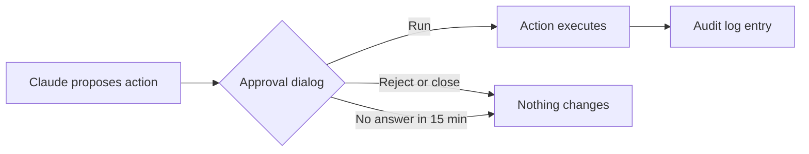

# Claude Assistant for OIE — User Manual

Version 0.2.7 · September 2026

The Claude Assistant (version 0.2.7) puts a Claude chat inside the Open Integration Engine Administrator and web administrator. It reads channels, messages, logs and scripts, and it changes nothing without your approval.

## Contents

- [Overview](#overview)
- [Requirements](#requirements)
- [Installation and upgrade](#installation-and-upgrade)
- [First-time setup](#first-time-setup)
- [Using the Administrator (Swing) client](#using-the-administrator-swing-client)
- [Using the web administrator](#using-the-web-administrator)
- [What Claude can read](#what-claude-can-read)
- [Actions and approval](#actions-and-approval)
- [Privacy and masking](#privacy-and-masking)
- [Permissions](#permissions)
- [Usage and costs](#usage-and-costs)
- [No internet and proxies](#no-internet-and-proxies)
- [Troubleshooting](#troubleshooting)
- [Known limitations](#known-limitations)

## Overview

Ask Claude a question in plain language and it looks up the answer on your OIE server itself. Typical questions:

- "Which channels have errors, and why?"
- "Explain why this message was filtered."
- "What does the transformer in this channel do?"
- "Is this code template used anywhere?"

Claude reads through built-in tools (see *What Claude can read*). It can also propose actions, such as redeploying a channel or fixing a script. Those run only after you click *Run*.

The assistant is available in two places, and both use the same server and settings:

| Client | Where to start |
| --- | --- |
| OIE Administrator (Swing) | *Other > Claude Assistant*, or *Ask Claude* in a view |
| OIE web administrator | *Plugins > Claude Assistant*, or *Ask Claude* in a view |

Patient data is masked before anything leaves the server (see *Privacy and masking*).

## Requirements

| Item | Requirement |
| --- | --- |
| OIE server | Open Integration Engine 4.6.0 or later |
| Network | The OIE server can reach `https://api.anthropic.com` (or a gateway, see *No internet and proxies*) |
| Anthropic API key | A key from the [Claude Console](https://console.anthropic.com) with credits or billing set up |
| Admin API key (optional) | Only needed to show spend; organization admins only |
| Web administrator (optional) | The **Web Support** (`websupport`) extension on the engine |
| OIE user | The Claude Assistant permissions (see *Permissions*) |

The Administrator workstation needs no internet access. All calls to Anthropic go from the OIE server.

## Installation and upgrade

Download `claude-assistant-<version>.zip` from the [GitHub releases](https://github.com/matthydehoog/Claude-plugin-Eclipse-OIE/releases).

1. In the Administrator, open *Settings > Extensions* and click *Install Extension*. Select the zip.
   - Alternative: unzip it into `<OIE_HOME>/extensions/`.
2. Restart the OIE service.
3. Check that `extensions/claude-assistant/lib/` contains the engine jars.
4. Log in to the Administrator again. *Claude Assistant* now appears under *Other* in the left menu.

**Upgrade:** install the new zip the same way and restart the service. Settings and API keys are kept.

Each release lists the SHA-256 checksum of its zip. Compare it before installing on a production server.

## First-time setup

Open *Settings > Claude Assistant*, enter the API key and click *Save*. That is all you need to start chatting.

The key is stored encrypted on the server and never sent back to the Administrator. After saving, the field empties and the line below it shows *Set: sk-ant-…xxxx*. An empty field on reopening is normal.

| Setting | Default | What it does |
| --- | --- | --- |
| API key | none | Anthropic key used for every question |
| Model | `claude-opus-5` | The Claude model that answers |
| Effort | `high` | How hard Claude thinks; lower is faster and cheaper |
| Max tool calls | 25 | Lookups Claude may do for one question |
| Response language | Automatic | Automatic answers in the language of the question; a fixed language always answers in that language |
| Review before sending | Message content, logs and events | Which outgoing data you see, can edit and must approve first (see *Review before sending*) |
| Mask patterns | none | Extra regular expressions to mask, on top of the built-in rules |
| Admin API key | none | Optional, only for the spend figures (see *Usage and costs*) |

To get an API key, sign in at [console.anthropic.com](https://console.anthropic.com), open *API keys* and click *Create key*. Copy it straight away: the Console shows it only once.

## Using the Administrator (Swing) client

Start from the place your question is about: *Ask Claude* there sends the selection along as context, so you don't have to name it.

| Place | How | Context sent along |
| --- | --- | --- |
| Left menu, **Other** | *Claude Assistant* | None: questions about the whole server |
| **Dashboard** | Task or right-click, *Ask Claude* | Selected channel(s) or connectors |
| **Message browser** | Task or right-click, *Ask Claude* | Selected message (channel, message ID, connector) |
| **Channel editor** | Task or right-click, *Ask Claude* | The open channel (its saved version) |
| **Code Templates** | Task or right-click, one template selected | The template and its library |
| **Global Scripts** | Task or right-click, *Ask Claude* | The deploy, undeploy, preprocessor and postprocessor scripts |

The context shows at the top of the chat window. *No context* means Claude looks at the whole server.

**In the chat window:**

- Type your question and press **Ctrl+Enter** (or click *Send*).
- Claude shows which tools it is using while it works. Long answers can take a minute or more.
- **Stop** aborts the running question.
- **New conversation** starts over with an empty history.

The window stays open next to the Administrator, so you can keep working while Claude answers. Unsaved changes in the channel editor are not visible to Claude: save first.

## Using the web administrator

The web administrator gets the same assistant once the **Web Support** extension is installed on the engine. Conversations, masking, permissions and approvals work exactly as in Swing.

| Place | What you get |
| --- | --- |
| Left rail, **Plugins > Claude Assistant** | The chat as a full page |
| **Channel editor**, tab **Claude** | The chat with the open channel as context |
| **Channels** view, right-click | *Ask Claude* about the selected channel |
| **Message browser**, right-click | *Ask Claude* about the selected message (web admin API 4.7+) |
| **Code Templates**, right-click | *Ask Claude* about the selected template |
| **Claude page**, button **Global Scripts** | The global scripts as context |
| **Command palette** (Ctrl+K) | *Claude Assistant* and *Ask Claude about Global Scripts* |
| **Settings**, tab **Claude Assistant** | Same settings and usage as in Swing; save with the page's own *Save* |

A conversation stays open while you move between the Claude page and other views.

The Global Scripts view in the web administrator has no *Ask Claude* action. Use the **Global Scripts** button on the Claude page instead.

**Command palette:** open the Dashboard once before searching for "Claude" with Ctrl+K. Searching earlier crashes the palette ([oie-web-client#65](https://github.com/gibson9583/oie-web-client/issues/65)).

## What Claude can read

Claude uses these read tools on its own, without asking. They change nothing.

| Tool | What it returns |
| --- | --- |
| Server info | Version, status, JVM and OS, memory and disk space |
| List channels | All channels with deploy state and counters, channels with errors first |
| Get channel | Full channel configuration: connectors, filters, transformers, scripts |
| Channel scripts | Every script in a channel with its location |
| Channel statistics | Counters per connector for one channel |
| Search messages | Messages by status, period or text, optionally with (masked) content |
| Get message | One message with raw, transformed, encoded, sent and response content, maps and errors |
| Events | Audit and server events: deploys, errors, logins |
| Server log | The most recent lines of the OIE server log |
| Code templates | Libraries, templates, their code and linked channels |
| Global scripts | The global deploy, undeploy, preprocessor and postprocessor scripts |
| Configuration Map | The keys only; values are never returned |

At most 25 tool calls are made per question by default (*Max tool calls*). Raise it for broad questions across many channels.

## Actions and approval

Claude can propose changes, but each one waits for your approval in a dialog. Nothing changes until you click **Run**.



The dialog shows exactly what will happen. For a script change it shows the new code. Closing the dialog counts as *Reject*, and Claude is told the action was refused.

| Action | Effect |
| --- | --- |
| Deploy / undeploy channel | Deploys (or redeploys) or undeploys a channel |
| Start / stop / pause / resume channel | Changes the state of a deployed channel |
| Reset statistics | Sets a channel's counters to zero |
| Reprocess message | Runs an existing message through the channel again |
| Send message | Sends a raw message to a deployed channel, for example to test a fix |
| Update channel script | Replaces a deploy, undeploy, pre/postprocessor script, JavaScript filter rule or transformer step |
| Update global script | Replaces a global deploy, undeploy, preprocessor or postprocessor script |

**Script changes** save the channel as a new revision but do not deploy it. Deploy separately when you are ready. If someone changed the channel in the meantime, nothing is saved.

**Audit:** every executed action is logged under *Events* as `Claude Assistant: <action>`, in the name of the user who approved it.

## Privacy and masking

Everything sent to Anthropic passes through a masker first. That includes your questions, context, message content, logs, errors and channel configuration. Masking cannot be switched off.

Masked by default:

- HL7 v2 PID fields 2–7, 9, 11, 13, 14 and 19
- HL7 v2 NTE comments: everything from NTE-3 onwards, however short
- Every HL7 text value longer than 30 characters, in any segment: free-text notes, report text, base64 documents such as a PDF in OBX-5
- GDT patient fields 3000–3107 (raw, and XML from the GDT data type plugin)
- 9-digit numbers that pass the eleven-test (Dutch BSN)
- Credentials in channel configuration: elements named like password, passphrase, secret, token or apiKey
- Your own regular expressions under *Settings > Claude Assistant > Mask patterns*

The HL7 rules apply to raw (ER7) messages and to OIE's XML form, also when they are embedded (escaped) in the XML the tools return. The 30-character check applies per component, so short coded values stay readable and Claude can still debug the message:

```
before: OBX|1|ED|PDF^Report^L||^AP^PDF^Base64^JVBERi0xLjQKJcfsj6IK...||||||F
after:  OBX|1|ED|PDF^Report^L||^AP^PDF^Base64^***||||||F

before: NTE|1|L|Patient called, see Dr. Jansen
after:  NTE|1|L|***

unchanged: OBX|3|NM|12345-6^Glucose^LN||5.4|mmol/L|||||F
```

Add a mask pattern for any identifier the defaults miss, such as a hospital patient number format.

### Review before sending

Before message content, log lines or events go to Claude, a dialog shows exactly what would be sent, after masking. Nothing leaves the server until you decide.

- **Send to Claude** sends the text as shown, including any edits you made. Edited text is masked again.
- **Don't send**, or closing the dialog, withholds it. Claude is told the data was withheld and continues without it.
- No decision within 15 minutes counts as *Don't send*.

The scope is set under *Settings > Claude Assistant > Review before sending*:

| Option | What you review |
| --- | --- |
| Message content, logs and events (default) | Results of message search, message details, server log and events |
| Everything, including my question | Your question and every tool result |
| Off | Nothing; data is sent after masking without a dialog |

Reviewing needs only the *Use Claude Assistant* permission. The reviewed text is not written to the audit log.

Masking is a safety net, not anonymisation. Send real patient data only with a legal basis and a data processing agreement with Anthropic.

Conversations live only in the OIE server's memory. They are cleared 4 hours after last use and are visible only to the user who started them.

## Permissions

The extension adds three permissions, which you assign to roles in the RBAC extension.

| Permission | Allows |
| --- | --- |
| Use Claude Assistant | Chatting (read-only tools) |
| Run Claude Assistant actions | Approving proposed actions |
| Manage Claude Assistant settings | Changing API keys, model and mask patterns; viewing spend |

A user without *Run Claude Assistant actions* can chat but cannot run actions.

Users with channel restrictions cannot use the assistant, because its tools see all channels.

## Usage and costs

Every question is billed by Anthropic per token on the account of the API key. A question with several tool calls costs more than a single answer.

**Spend this month.** The *Usage* section of *Settings > Claude Assistant* shows spend for the whole organization and for the workspace of the plugin's API key. It needs the optional Admin API key:

1. Sign in to the [Claude Console](https://console.anthropic.com) as an organization admin.
2. Open *Settings > Admin keys* and create a key (`sk-ant-admin01-…`).
3. Paste it in *Admin API key* and click *Save*.

Individual accounts cannot create Admin API keys.

Amounts are in USD since the 1st of the month (UTC). They run up to about 5 minutes behind and are cached for a minute; *Refresh* fetches them again. The Cost API does not always report the current day, so the figure can be lower than the Console's Billing page. The Console is leading.

**Credit balance** is not available through any API. Click *Open Billing in Console* to see it.

**Keeping costs down:**

- Start from *Ask Claude* in the right view, so Claude needs fewer lookups.
- Use *New conversation* for a new topic; long histories are resent with every question.
- Lower *Effort* or pick a smaller model for routine questions.
- Prompt caching is on automatically; repeated context within a few minutes is billed at a lower rate.

Each model call writes a usage line (tokens and cache hits) to the OIE server log.

## No internet and proxies

Without internet only the assistant stops. Channels, message processing and both Administrators keep working, and the plugin makes no connections at startup or in the background.

A question then ends with *Cannot reach the Anthropic API from the OIE server (…)*, naming the cause, such as `UnknownHostException` or `Connect timed out`. The conversation is kept, so ask again when the connection is back.

Connecting times out after 10 seconds and is tried three times, so you get the message within about half a minute. An answer itself may take up to 10 minutes.

**Behind a gateway or proxy:** add this line to `conf/custom.vmoptions` and restart the service:

```
-Doie.claude.baseUrl=https://gateway.example/anthropic
```

## Troubleshooting

| Symptom | Cause | Fix |
| --- | --- | --- |
| *Claude Assistant* missing under *Other* | Extension not loaded or service not restarted | Check *Settings > Extensions*, restart the OIE service, log in again |
| API key field is empty after *Save* | By design: the key is never sent back | Check the line *Set: sk-ant-…xxxx* below the field |
| *Cannot reach the Anthropic API* | No internet, firewall or proxy on the OIE server | Allow `api.anthropic.com`, or set `oie.claude.baseUrl` |
| Authentication error | Wrong, revoked or expired API key | Create a new key in the Console and save it |
| Error about credits or billing | No credit left on the Anthropic account | Add credits under Billing in the Console |
| *No context* in the chat header | Opened from *Other*, not from a view | Normal: Claude looks at the whole server; use *Ask Claude* in a view for a specific item |
| Answers in the wrong language | *Response language* is *Automatic* and follows the question or data | Pick a fixed language in *Settings > Claude Assistant* |
| Claude doesn't see my latest change | The channel editor has unsaved changes | Save the channel, then ask again |
| *Run* is refused | Missing *Run Claude Assistant actions* permission | Ask an administrator to add it to your role |
| Spend lower than the Console | Today's costs not reported yet by the Cost API | Wait or use the Console's Billing page |
| No Claude items in the Ctrl+K palette search | Web admin bug before the Dashboard has loaded | Open the Dashboard first |
| Answer stops with tool-call limit reached | Question needs more lookups than *Max tool calls* | Narrow the question or raise the limit |
| Notes, report text or a code show as `***` | Masking by design: NTE comments and HL7 values over 30 characters are hidden from Claude | Normal; ask about structure and codes, or read the text yourself in the message browser |

For anything else, look in *Dashboard > Server Log* for lines starting with `Claude Assistant`.

## Known limitations

- Conversations are kept in server memory only; a service restart or 4 idle hours clears them.
- Claude sees only saved channel versions, not unsaved edits in the editor.
- Configuration Map values are never readable, only the keys.
- Users with channel restrictions cannot use the assistant.
- Script changes are saved, not deployed; deploying is a separate approved action.
- The web Global Scripts view has no *Ask Claude*; use the button on the Claude page.
- The credit balance cannot be shown in OIE; use the Console.
- Claude can be wrong. Check its conclusions and proposed changes before you click *Run*.

Source code, releases and issues: [github.com/matthydehoog/Claude-plugin-Eclipse-OIE](https://github.com/matthydehoog/Claude-plugin-Eclipse-OIE).
